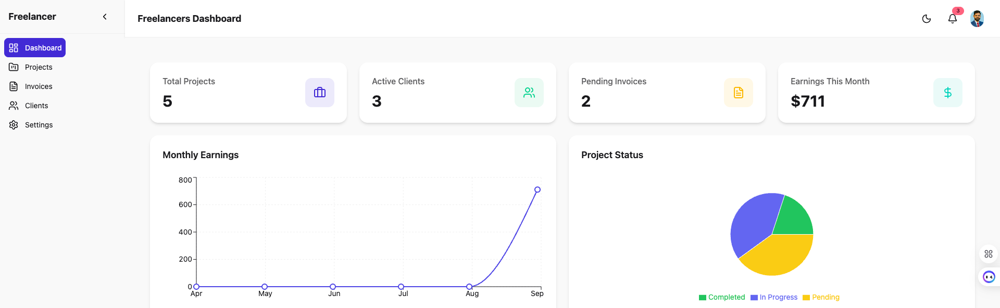
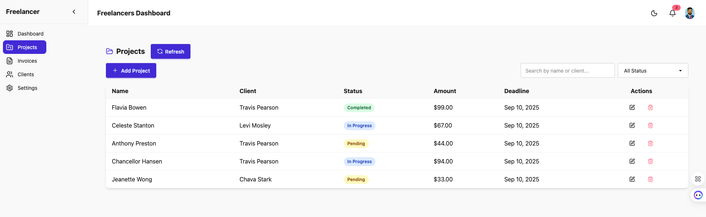
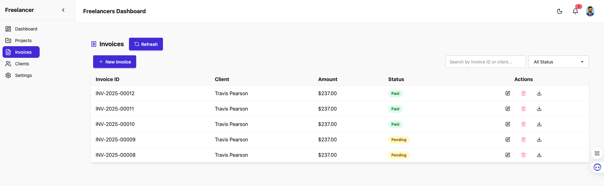
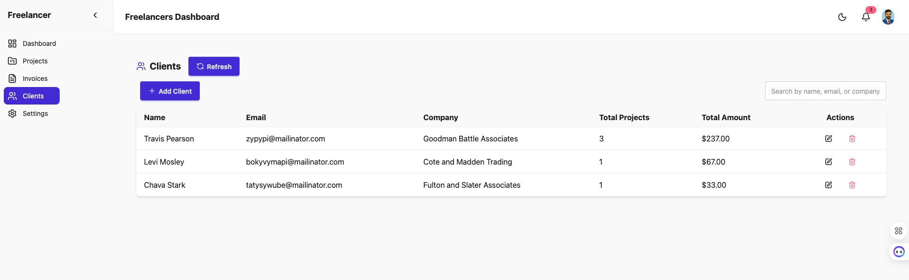
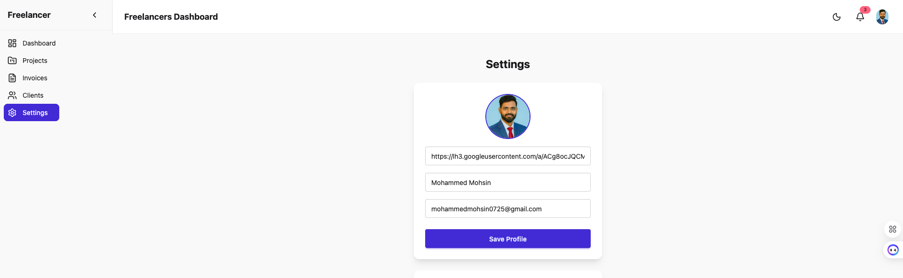
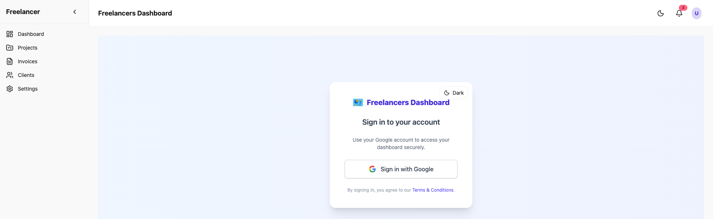

# 📊 Freelancers Dashboard

A modern **Freelancer Management Dashboard** built with **Next.js 15**, **TypeScript**, **MongoDB**, and **TailwindCSS**.  
This platform empowers freelancers to **manage projects, invoices, clients, and earnings** in a streamlined and professional way.

🌐 **Live Demo:** [freelancers-dashboard.vercel.app](https://freelancers-dashboard.vercel.app/)

---

## 🚀 Project Overview

The **Freelancers Dashboard** is a full-stack web application designed to simplify the workflow of freelancers.  
It provides a **centralized platform** where you can:

- Track **projects** with status, deadlines, and payments
- Manage **clients** and their associated projects
- Generate and track **invoices** (paid & pending)
- View **dashboard analytics** such as total projects, earnings, and invoice trends
- Update your **profile & settings** with Google authentication

The system is built for scalability with **Next.js App Router**, fully typed with **TypeScript**, and powered by a **MongoDB database**.

---

## 📸 Screenshots

### Dashboard


### Projects


### Invoices


### Clients


### Settings


### Login



---

## ✨ Features

- 🔑 **Authentication** with NextAuth (Google OAuth)
- 📂 **Projects Management** – add, edit, track status & deadlines
- 👥 **Clients Management** – maintain client details and track their total projects/earnings
- 💰 **Invoices** – generate, mark as paid/pending, and download PDF invoices
- 📊 **Dashboard Analytics** – view earnings, invoice trends, and project stats
- 🎨 **Responsive UI** with TailwindCSS + DaisyUI
- ⚡ **Smooth Animations** powered by Framer Motion
- 🗄️ **MongoDB Atlas** as backend database
- ☁️ **Deployed on Vercel**

---

## 🛠️ Tech Stack

- **Frontend:** Next.js 15, TypeScript, TailwindCSS, DaisyUI, Framer Motion, Recharts
- **Backend:** Next.js API Routes, MongoDB Atlas
- **Authentication:** NextAuth.js (Google OAuth)
- **Database ORM:** MongoDB Driver
- **Deployment:** Vercel

---

## ⚙️ Installation & Setup

### 1️⃣ Clone the repo
```bash
git clone https://github.com/MohammedMohsin404/Freelancers-Dashboard.git
cd Freelancers-Dashboard
```

### 2️⃣ Install dependencies
```bash
yarn install
# or
npm install
```

### 3️⃣ Setup environment variables
Create a `.env.local` file in the root with the following:
```env
# MongoDB
MONGODB_URI=your-mongodb-connection-string

# NextAuth
AUTH_GOOGLE_ID=your-google-client-id
AUTH_GOOGLE_SECRET=your-google-client-secret
NEXTAUTH_SECRET=your-secret-key

# App
NEXT_PUBLIC_APP_URL=http://localhost:3000
```

### 4️⃣ Run development server
```bash
yarn dev
# or
npm run dev
```

Visit 👉 [http://localhost:3000](http://localhost:3000)

### 5️⃣ Build for production
```bash
yarn build
yarn start
```

---

## 📡 API Endpoints

### Clients
- `GET /api/clients` → Get all clients
- `POST /api/clients` → Create a client
- `PUT /api/clients/:id` → Update a client
- `DELETE /api/clients/:id` → Delete a client

### Projects
- `GET /api/projects` → Get all projects
- `POST /api/projects` → Create a project
- `PUT /api/projects/:id` → Update a project
- `DELETE /api/projects/:id` → Delete a project

### Invoices
- `GET /api/invoices` → Get all invoices
- `POST /api/invoices` → Create an invoice
- `PUT /api/invoices/:id` → Update invoice
- `DELETE /api/invoices/:id` → Delete invoice
- `GET /api/invoices/:id/pdf` → Generate invoice PDF

### Stats
- `GET /api/stats` → Fetch dashboard analytics

---

## 🛣️ Roadmap

Planned features for future releases:

- 🔄 **Recurring Invoices** – automate repeat billing
- 💳 **Stripe Integration** – accept client payments online
- 🔔 **Smart Notifications** – email & in-app alerts for deadlines and invoices
- 📅 **Calendar View** – visualize deadlines and payments in a calendar UI
- 📱 **Mobile App Support** – React Native companion app
- 🛡️ **Role-Based Access Control (RBAC)** – invite team members with roles

---

## 🚀 Deployment

The project is deployed on **Vercel**.  
Simply connect your GitHub repo, add the `.env.local` variables in Vercel settings, and deploy 🚀.

---

## 📄 License

This project is licensed under the **MIT License**.

---

## 👨‍💻 Author

**Mohammed Mohsin**  
📧 [mohammedmohsin0725@gmail.com](mailto:mohammedmohsin0725@gmail.com)  
🔗 [LinkedIn](https://www.linkedin.com/in/mohammedmohsin404/) | [GitHub](https://github.com/MohammedMohsin404)
